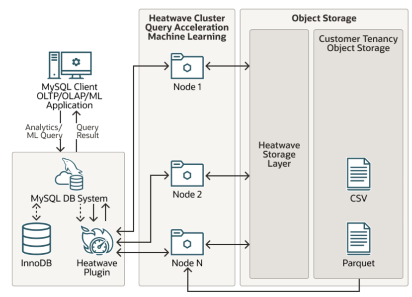
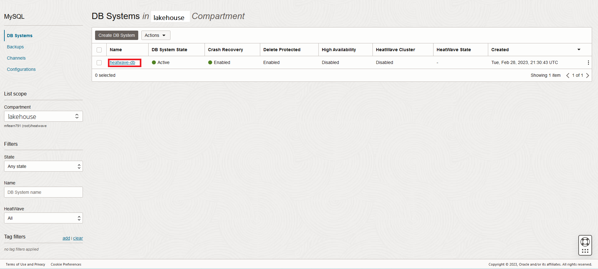
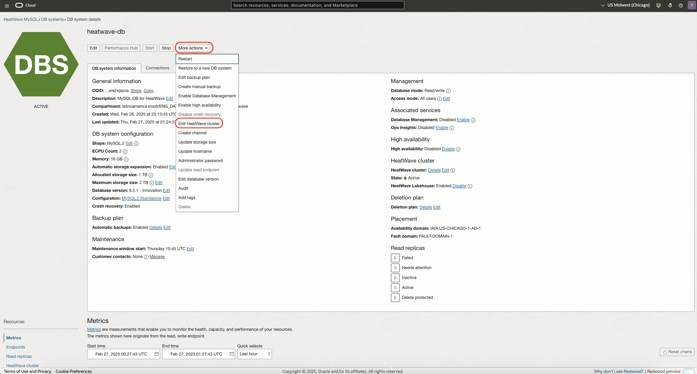
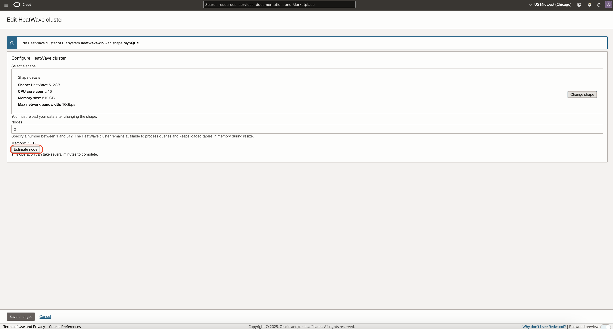
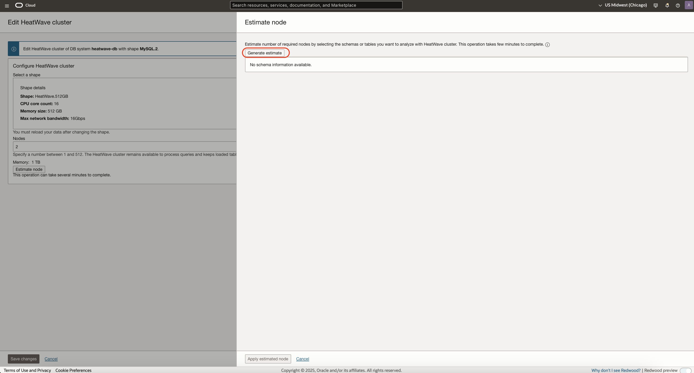
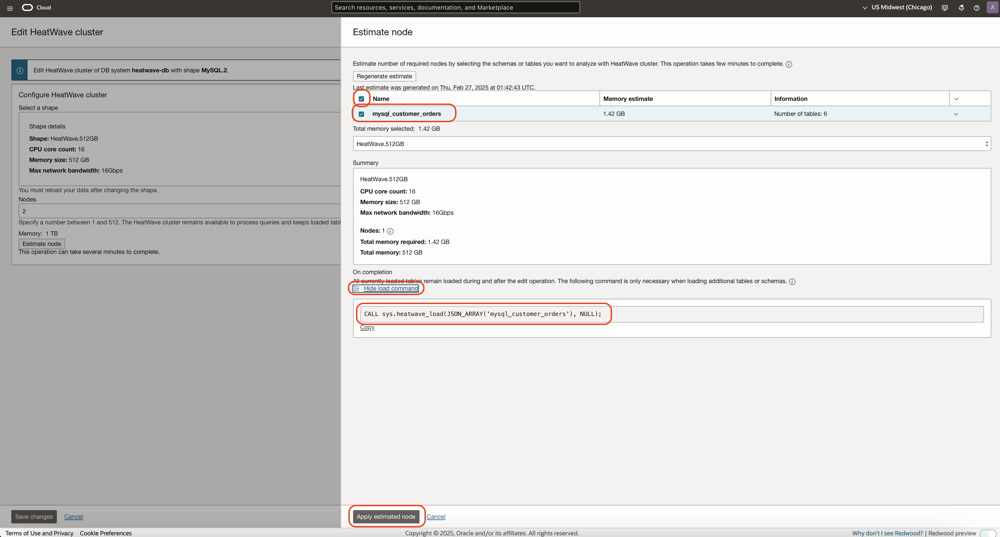
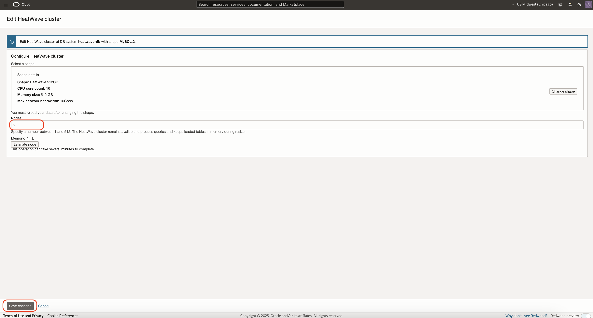

# Create Mysql HeatWave Cluster and test MySQl Shell

## Introduction

A HeatWave cluster comprise of a MySQL DB System and one or more HeatWave nodes. The MySQL DB System includes a plugin that is responsible for cluster management, loading data into the HeatWave cluster, query scheduling, and returning query result.



_Estimated Time:_ 15 minutes

### Objectives

In this lab, you will be guided through the following task:

- Add a HeatWave Cluster to heatwave-db MySQL Database System
- Connect to database using MySQL Shell

### Prerequisites

- An Oracle Trial or Paid Cloud Account
- Some Experience with MySQL Shell
- Completed Lab 2

## Task 1: Connect to database using MySQL Shell

1. If not already connected with SSH, on Command Line, connect to the Compute instance using SSH ... be sure replace the  "private key file"  and the "new compute instance ip"

     ```bash
    <copy>ssh -i private_key_file opc@new_compute_instance_ip</copy>
     ```

2. Use the following command to connect to MySQL using the MySQL Shell client tool. Be sure to add the **heatwave-db** private IP address at the end of the command. Also enter the admin user and the db password created on Lab 1

    (Example  **mysqlsh -uadmin -p -h10.0.1..   --sql**)

    **[opc@...]$**

    ```bash
    <copy>mysqlsh -uadmin -p -h 10.0.1.... --sql</copy>
    ```

    

3. List schemas in your heatwave instance

    ```bash
    <copy>show databases;</copy>
    ```

    

4. if you do not see the **mysql\_customer\_orders** schema on the list, then load it using the following commands:
    - a. change to JS

        ```bash
        <copy>\js</copy>
        ```

    - b. Run load caommand

        ```bash
        <copy>util.loadDump("https://objectstorage.us-ashburn-1.oraclecloud.com/p/0pZRzTl1hFLchwAcornQVePE7eXxp1u6rjVVF3i7a5qN7HASVk4CtTQ9BK9y4xIG/n/mysqlpm/b/plf_mysql_customer_orders/o/mco_nocoupon_dump_05242023/", {progressFile: "progress.json", loadIndexes:false})</copy>
        ```

        **Note**: If you get errors like the one below, the **mysql\_customer\_orders** schema already exists. You used the correct PAR Link to load the data during the creation process in Lab1. Don't worry; everything is okay.

         *ERROR: Schema `mysql_customer_orders` already contains a table named customers*

    - c. Make sure the **mysql\_customer\_orders** schema was loaded

        ```bash
        <copy>show databases;</copy>
        ```

        

    - d. Change to SQL mode

        ```bash
        <copy>\sql</copy>
        ```

5. View  the mysql\_customer\_orders total records per table in

    ```bash
    <copy>SELECT table_name, table_rows FROM INFORMATION_SCHEMA.TABLES WHERE TABLE_SCHEMA = 'mysql_customer_orders';</copy>
    ```

    

6. Run OLTP Query in MySQL

    ```bash
    <copy>use mysql_customer_orders;</copy>
    ```

    ```bash
    <copy>SELECT * FROM stores limit 10;</copy>
    ```

7. Run OLAP Query in MySQL

    ```bash
    <copy>select `o`.`ORDER_ID` AS `order_id`,`o`.`ORDER_DATETIME` AS `ORDER_DATETIME`,
    `o`.`ORDER_STATUS` AS `order_status`, `c`.`CUSTOMER_ID` AS `customer_id`,
    `c`.`EMAIL_ADDRESS` AS `email_address`,`c`.`FULL_NAME`  AS `full_name`,
    sum((`oi`.`QUANTITY` * `oi`.`UNIT_PRICE`)) AS `order_total`,
    `p`.`PRODUCT_NAME` AS `product_name`,`oi`.`LINE_ITEM_ID` AS `LINE_ITEM_ID`,
    `oi`.`QUANTITY`  AS `QUANTITY`,`oi`.`UNIT_PRICE` AS `UNIT_PRICE` 
from (((`orders` `o` join `order_items` `oi` on((`o`.`ORDER_ID` = `oi`.`ORDER_ID`))) 
    join `customers` `c` on((`o`.`CUSTOMER_ID` = `c`.`CUSTOMER_ID`))) 
    join `products` `p` on((`oi`.`PRODUCT_ID` = `p`.`PRODUCT_ID`))) 
group by `o`.`ORDER_ID`,`o`.`ORDER_DATETIME`,`o`.`ORDER_STATUS`,`c`.`CUSTOMER_ID`
    ,`c`.`EMAIL_ADDRESS` ,`c`.`FULL_NAME`,`p`.`PRODUCT_NAME`
    ,`oi`.`LINE_ITEM_ID`,`oi`.`QUANTITY`,`oi`.`UNIT_PRICE` limit 10;</copy>
    ```
    **Note** It takes a while to execute

## Task 2: Offload relational data to the HeatWave Cluster

1. Go to Navigation Menu -> Databases -> HeatWave MySQL

2. Click the `heatwave-db` Database System link

    

3. In the list of DB Systems, click the **heatwave-db** system. click **More Action ->  Edit HeatWave Cluster**.
    

4. Enable the **MySQL HeatWave LakeHouse** checkbox

5. Set **Node Count to 2** for this Lab Click **Estimate Node** to begin a full scan of the data within the DB System

    

6. Click the **Generate Estimate** button to begin a full scan of the data within the DB System

    

    - The full scan may take a couple of minutes

7. Once the full scan is completed, select all the schemas availabe

    - Click on the **Show load command** link, this will display a procedure command

    ```bash
    <copy>CALL sys.heatwave_load(JSON_ARRAY('mysql_customer_orders'), NULL);</copy>
    ```

    - Copy the generated procedure into a notepad for later use

    - Click on the **Apply Estimated Node** button

    

8. Set **Node Count to 2** if it changed after the node estimation process, then click on the **Save Changes** button

    

You may now **proceed to the next lab**

## Acknowledgements

- **Author** - Perside Foster, MySQL Solution Engineering

- **Contributors** - Abhinav Agarwal, Senior Principal Product Manager, Nick Mader, MySQL Global Channel Enablement & Strategy Manager, Oscar Cárdenas, MySQL Solution Engineering
- **Last Updated By/Date** - Oscar Cárdenas, MySQL Solution Engineering, March 2023
