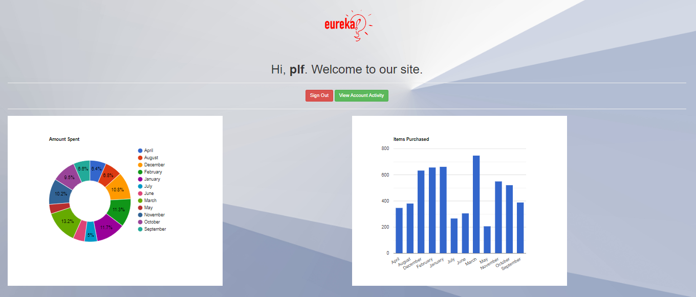
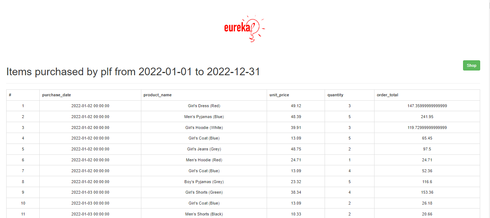

# Develop MySQL HeatWave App with LAMP

## Introduction

MySQL HeatWave can easily be used for development tasks with existing Oracle services, such as Oracle Analytics Cloud. New applications can also be created with the LAMP or other software stacks.

**Note:** This application code is intended for educational purposes only. It is designed to help developers learn and practice application development skills with MySQL HeatWave on OCI. The code is not designed to be used in a production environment

_Estimated Lab Time:_ 15 minutes

### Objectives

In this lab, you will be guided through the following tasks:

- Create LAMP e-commerce Application
- Run the e-commerce Application

### Prerequisites

- An Oracle Trial or Paid Cloud Account
- Some Experience with MySQL SQL and  PHP
- Completed Lab **Develop MySQL HeatWave App with LAMP**

## Task 1: Create the e-commerce Application

1. If not already connected with SSH, on Command Line, connect to the Compute instance using SSH ... be sure replace the  "private key file"  and the "new compute instance ip"

     ```bash
    <copy>ssh -i private_key_file opc@new_compute_instance_ip</copy>
     ```

2. Go to the development folder

    ```bash
    <copy>cd /var/www/html</copy>
    ```

3. Get the Application files  from Object Stogage

    ```bash
    <copy>sudo wget  https://objectstorage.us-ashburn-1.oraclecloud.com/p/L9dof_K9Rzplf59I4PBFbnZpn20EdvzlYWqAxtff0PRiLlmRtXPpfOmf-p4CR_3R/n/mysqlpm/b/mysql_customer_orders/o/orders_web_no_coupon.zip</copy>
    ```

4. Unnzip orders_web_no_coupon.zip file

    ```bash
    <copy>sudo unzip orders_web_no_coupon.zip </copy>
    ```

5. Open the config.php file 

    ```bash
    <copy>sudo nano orders_web/config.php </copy>
    ```

    Change config.php by replacing the mysql\_customer\_orders schema 'localhost' with heatwave-db IP address,username, and password;

    - Save the orders_web/config.php
    

## Task 4: Run the e-commerce Application

1. From your local machine connect to heatwave-client IP Address/orders_web/login.php 

    Example: http://999.999.999/orders_web/login.php

2. Login with the following information

    a. username: 

    ```bash
    <copy>plf </copy>
    ```

    b. password:

    ```bash
    <copy>hello123</copy>

    ```

    

3. From the Welcome Page click the "View Account Activity" button

    

4. From the Items purchased Page click the "Shop" button

    

5. From the Promotion Shop Page select Items to purchase and click the "Submitt" button

    

6. From the Items Purchase Page select a "Delivery Location" and  click the  and the  "Continue" button

    

7. From the Thank You  Page   click the "Signout" button

    

## Learn More

[https://dev.mysql.com/doc/heatwave/en/mys-hw-lakehouse.html](https://dev.mysql.com/doc/heatwave/en/mys-hw-lakehouse.html)

## Acknowledgements

- **Author** - Perside Foster, MySQL Solution Engineering

- **Contributors** - Abhinav Agarwal, Senior Principal Product Manager, Nick Mader, MySQL Global Channel Enablement & Strategy Manager
- **Last Updated By/Date** - Perside Foster, MySQL Solution Engineering, May 2023