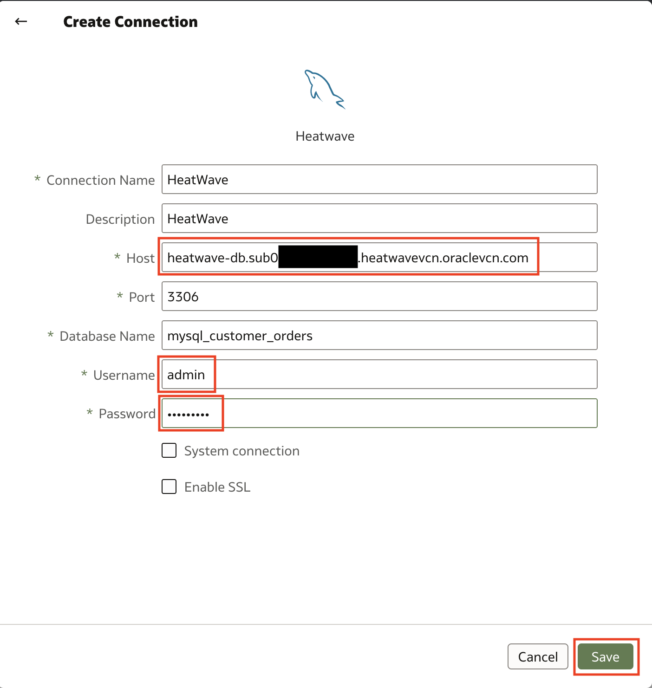
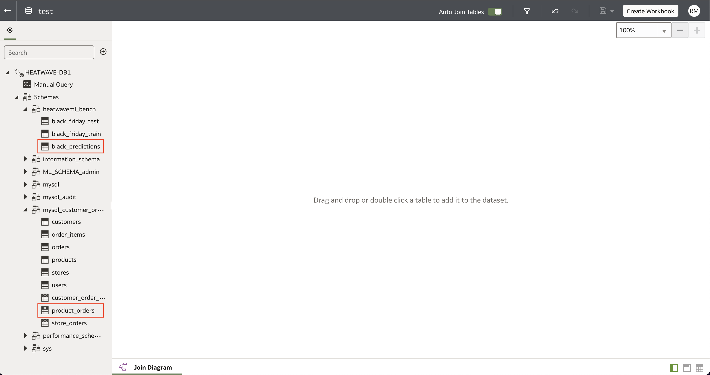
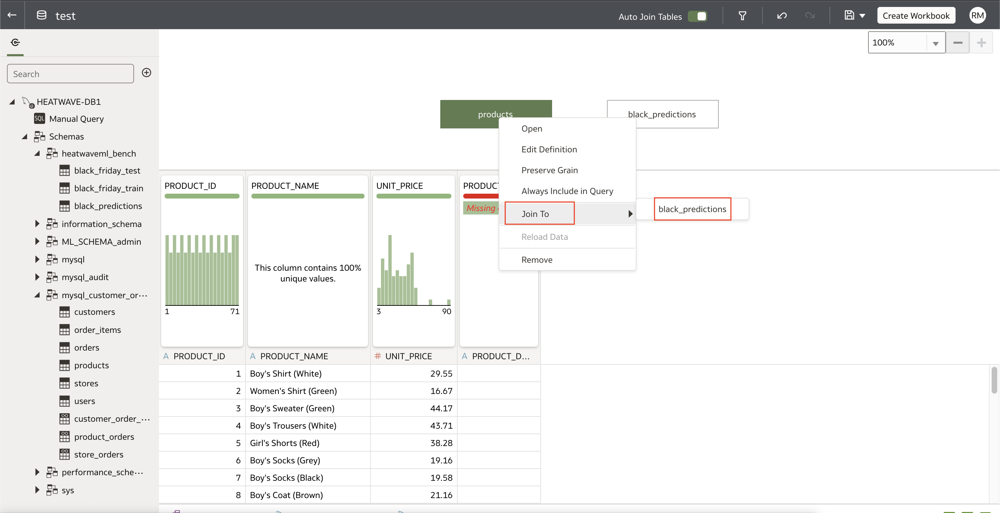
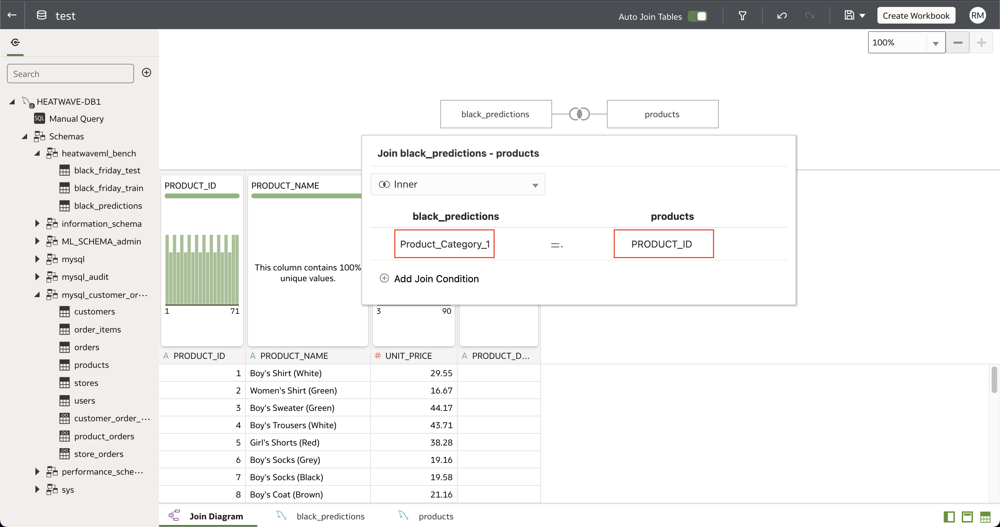
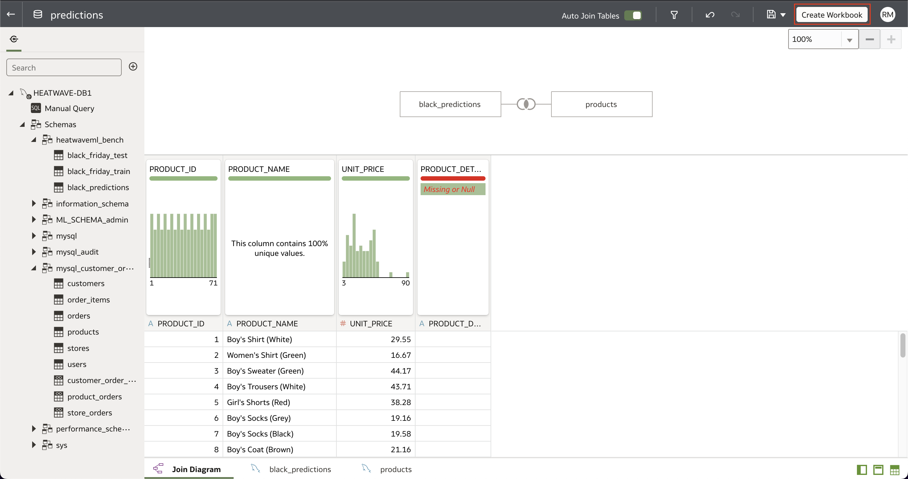
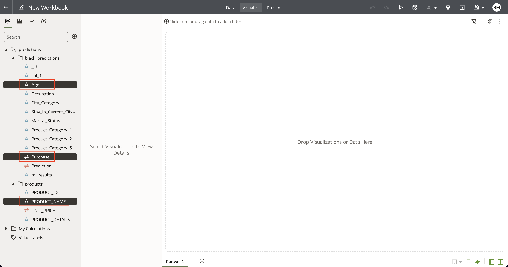
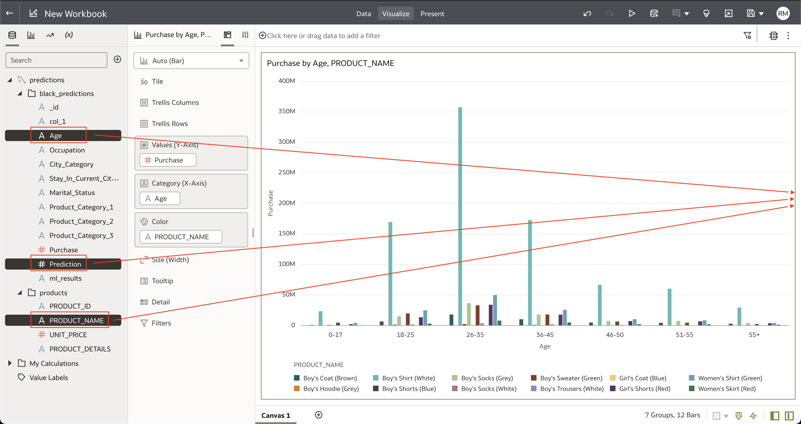
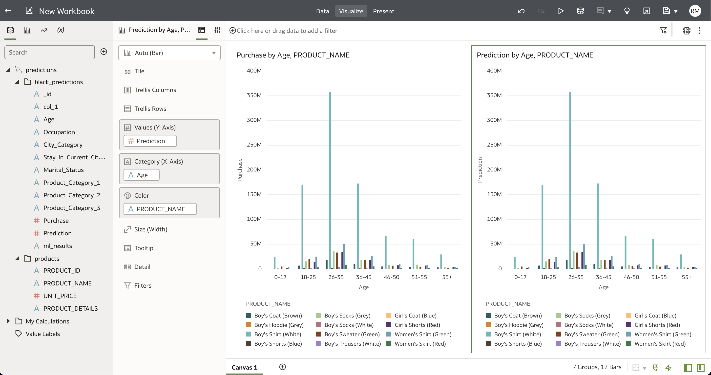

# Build a real-time dashboard in Oracle Analytics Cloud with MySQL HeatWave  - black_friday

## Introduction

MySQL HeatWave can easily be used for development tasks with existing Oracle services, such as Oracle Cloud Analytics. -> Oracle Analytics Cloud (OAC) provides the industry’s most comprehensive cloud analytics in a single unified platform, including self-service visualization and inline data preparation to enterprise reporting, advanced analytics, and self-learning analytics that deliver proactive insights.

Use MySQL HeatWave with OAC to explore and perform collaborative analytics with your MySQL data.

_Estimated Time:_ 10 minutes

### Objectives

In this lab, you will be guided through the following tasks:

- Create a predictions dataset on OAC using the mysql\_customer\_orders and black_predictions tables
- Create visualizations on OAC using the predictions dataset

### Prerequisites

- An Oracle Trial or Paid Cloud Account
- Some Experience with MySQL Shell
- Completed Lab 9

## Task 1: Create Connection from HeatWave DB to OAC

1. Navigate to Menu > Analytics > Analytics Clouds

2. Select the OAC instance you provisioned to access the OAC console by clicking on Analytics Home Page. Click on the **Analytics Home Page** button.
    

3. Create a Connection to HeatWave to build a dashboard
    

4. Click the **Create Connection** button
    

5. Search for HeatWave and select HeatWave as the database.
    

6. Specify the connections details
    - Specify the hostname of heatwave-db
    - Use the FQDN information you save in Step 3
    - Port: 3306
    - Database Name: mysql\_customer\_orders
    - Be sure to use the Heatwave DB username and password

    Hit the **Save** button to finish creating the connection.
    

7. The completed connection will display a "New Dataset" page.

## Task 2: Create a dataset using mysql customer orders and black_predictions tables

1. Click on the arrow beside **heatwaveml_bench** and **mysql\_customer\_orders**. Drag and drop the **products** and **black\_predictions** table from the sidebar into the **New Dataset** page.
    

2. Right click on **products**, click **Join To** and select **black\_predictions**.
    

3. Leave the join type as **Inner**, select **Product\_Category\_1** under black\_predictions and **PRODUCT\_ID** under products.
    

4. Save the dataset as **predictions**.

## Task 3: Create visualizations using the predictions dataset

1. In the top right corner of the OAC window, click **Create Workbook**
    

2. Click the dropdown arrow for **black\_predictions** and **products**. From the **products** list, drag and drop **PRODUCT\_NAME** into the blank canvas. From the **black\_predictions** list, drag and drop **Age** and **Purchase**.
    

3. OAC chooses the best-fit visualization for the data provided, which is a bar chart. We will leave this as-is and create a second visualization to compare the purchases by age with the predictions by age.

4. From the **products** list, drag and drop **PRODUCT\_NAME** on the right of the visualization we created in the previous steps. From the **black\_predictions** list, drag and drop **Age** and **Prediction**.
    

5. This creates a side-by-side comparison of Purchase by age and product name vs. Predictions by age and product name as shown below.
        

**Congratulations! You have successfully finished this Lab. Please proceed to the next lab.**

## Acknowledgements

- **Author** - Runit Malik, MySQL Cloud Solution Engineer
- **Contributors** - Perside Foster, MySQL Principal Solution Engineer
- **Last Updated By/Date** - Runit Malik, MySQL Cloud Solution Engineer, November 2023