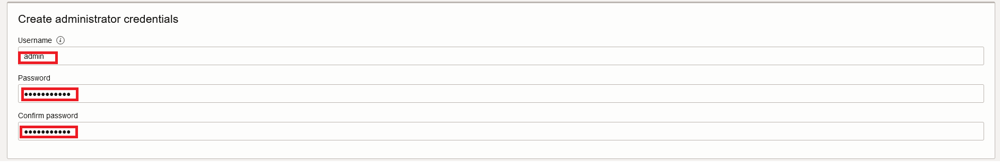
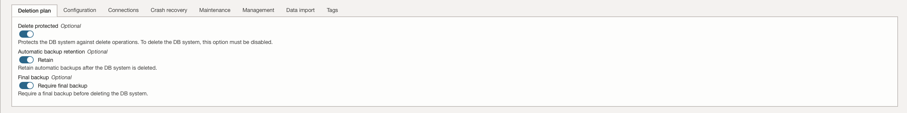
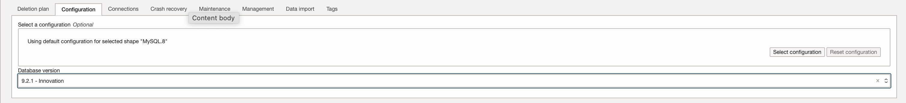
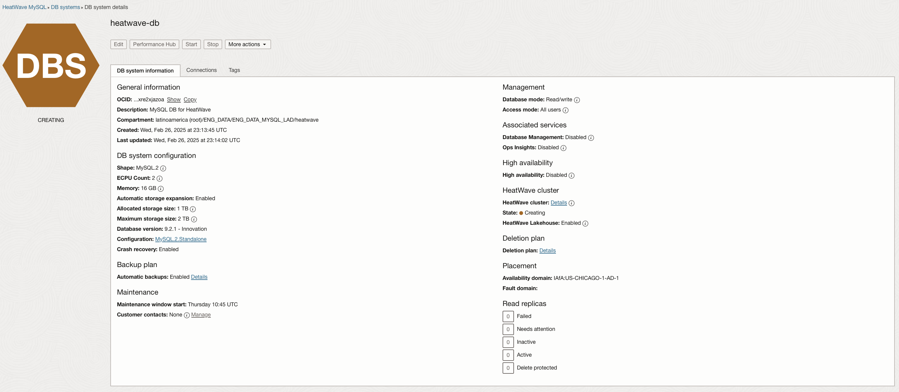

# Create Compartment, VCN, and HeatWave Database

## Introduction

In this lab, you will create a Compartment and  Virtual Cloud Network (VCN) to connect your OCI resources. You will also create a HeatWave DB System while loading the DB Data.

_Estimated Time:_ 20 minutes

### Objectives

In this lab, you will be guided through the following tasks:

- Create a Compartment
- Create a Virtual Cloud Network
- Configure a security list to allow MySQL incoming connections
- Create a MySQL Database for HeatWave DB System while loading the DB Data


### Prerequisites

- An Oracle Trial or Paid Cloud Account
- Login to OCI to land on OCI Dashboard


## Task 1: Create Compartment

1. Click the **Navigation Menu** in the upper left, navigate to **Identity & Security** and select **Compartments**.

2. On the Compartments page, click **Create Compartment**.

3. In the Create Compartment dialog box, complete the following fields:

    Name:

    ```bash
    <copy>heatwave</copy>
    ```

    Description:

    ```bash
    <copy>Compartment for HeatWave Database workshop </copy>
    ```

4. The **Parent Compartment** should be **root** and click **Create Compartment**
    

## Task 2: Create Virtual Cloud Network

1. Click Navigation Menu
    Select Networking
    Select Virtual Cloud Networks
    

2. Click **Start VCN Wizard**
    

3. Select 'Create VCN with Internet Connectivity'

    Click 'Start VCN Wizard'
    

4. Create a VCN with Internet Connectivity

    On Basic Information, complete the following fields:

    VCN Name:

    ```bash
    <copy>heatwave-vcn</copy>
    ```

    Compartment: Select  **heatwave**

    Your screen should look similar to the following
        

5. Click 'Next' at the bottom of the screen

6. Review Oracle Virtual Cloud Network (VCN), Subnets, and Gateways

    Click 'Create' to create the VCN

7. The Virtual Cloud Network creation is completing
    

8. Click 'View VCN' to display the created VCN
    

## Task 3: Configure security list to allow MySQL incoming connections

1. On heatwave-vcn page under 'Subnets in heatwave Compartment', click  '**private subnet-heatwave-vcn**'
     

2. On Private Subnet-heatwave-vcn page under 'Security',  click  '**Security List for private subnet-heatwave-vcn**'
    

3. On Security List for Private Subnet-heatwave-vcn page under 'Security Rules', click '**Add Ingress Rules**'
    

4. On Add Ingress Rules page under Ingress Rule

    Add an Ingress Rule with Source CIDR

    ```bash
    <copy>0.0.0.0/0</copy>
    ```

    Source Port Range

    ```bash
    <copy>All</copy>
    ```

    Destination Port Range

    ```bash
    <copy>3306,33060</copy>
    ```

    Description

    ```bash
       <copy>MySQL Port Access</copy>
    ```

5. Click 'Add Ingress Rule'
    

6. On Security List for Private Subnet-heatwave-vcn page, the new Ingress Rules will be shown under the Ingress Rules List
    

## Task 4: Configure security list to allow HTTP incoming connections

1. Navigation Menu > Networking > Virtual Cloud Networks

2. Open heatwave-vcn

3. Click  public subnet-heatwave-vcn

4. Click Default Security List for heatwave-vcn

5. Click Add Ingress Rules page under Ingress Rule

    Add an Ingress Rule with Source CIDR

    ```bash
    <copy>0.0.0.0/0</copy>
    ```

    Source Port Range

    ```bash
    <copy>All</copy>
    ```

    Destination Port Range

    ```bash
    <copy>80,443</copy>
    ```

    Description

    ```bash
    <copy>Allow HTTP connections</copy>
    ```

6. Click 'Add Ingress Rule'

    

7. On Security List for Default Security List for heatwave-vcn page, the new Ingress Rules will be shown under the Ingress Rules List

    

## Task 5: Create MySQL Database for HeatWave (DB System)

1. Go to Navigation Menu -> Databases -> HeatWave MySQL -> DB Systems
    

2. Click 'Create HeatWave DB System'
    

3. Select the Development or Testing Option
    

4. Create MySQL DB System dialog complete the fields in each section

    - Provide basic information for the DB System
    - Setup your required DB System
    - Create Administrator credentials
    - Configure Networking
    - Configure placement
    - Configure hardware
    - Exclude Backups
    - Advanced Options - NetWorking
    - Advanced Options - Data Import

5. Provide basic information for the DB System:

    Select Compartment **heatwave**

    Enter Name

    ```bash
    <copy>heatwave-db</copy>
    ```

    Enter Description

    ```bash
    <copy>MySQL DB for HeatWave</copy>
   ```

    

6. Create Administrator Credentials

    **Enter Username** (write username to notepad for later use)
    - **Note**: user name is case sensitive so use **admin** to match the the labs' connect string example

    **Enter Password** (write password to notepad for later use)

    **Confirm Password** (value should match password for later use)

    

7. Select **“Standalone”**
    

8. On Configure networking, keep the default values

    Virtual Cloud Network: **heatwave-vcn**

    Subnet: **Private Subnet-heatwave-vcn (Regional)**

    

9. On Configure placement under 'Availability Domain'

    Select AD-1

    Do not check 'Choose an Availability Domain' for this DB System.

    

10. On Configure hardware, keep default shape as **MySQL.2** and click on **Configure HeatWave Cluster** under HeatWave Cluster Configuration

    

11. On Configure HeatWave cluster, click on **Change Shape**

    

12. Select the radio button **HeatWave.512GB**, then click on **Select a Shape**

    

13. Lastly, specify **2** for the Nodes and enable **HeatWave LakeHouse** by click on the radio button. Then, click **Save Changes**.

    

14. On Storage Size, set a value of **1024** (GB), toggle on the **Automatic storage expansion** button. Then, set a value of **2048** (GB) under **Maximum data storage size**

    Initial data Storage Size (GB) Set value to:  **1024**

    ```bash
    <copy>1024</copy>
    ```

    Maximum data storage size (GB) Set value to:  **1024**

    ```bash
    <copy>2048</copy>
    ```

    

15. On Configure Backup Plan, enable automatic backups and keep the default:

    

16. **Optionaly**, provide an email under _Contact email_ to recieve updates and info on this particular service

17. Click on Show Advanced Options

18. Go to the Deletion Plan tab, and toggle all the options

    

19. Go to the Configuration tab, and select the latest innovation release version

    

20. Go to the Connections tab, in the Hostname field enter  (same as DB System Name):

    ```bash
    <copy>heatwave-db</copy> 
    ```

    

21. Select the Data Import tab.

22. Use the Image below to identify your OCI Region.

    

23. Click on your localized geographic area

    ## North America (NA)

    **Tenancy Regions** Please select the same region that you are creating **heatwave-db** in

    <details>
    <summary>US East (Ashburn) Region - Copy and paste to PAR Source URL</summary>
    <br>
    ```
    <copy>
    https://objectstorage.us-ashburn-1.oraclecloud.com/p/0pZRzTl1hFLchwAcornQVePE7eXxp1u6rjVVF3i7a5qN7HASVk4CtTQ9BK9y4xIG/n/mysqlpm/b/plf_mysql_customer_orders/o/mco_nocoupon_dump_05242023/
    </copy>
    ```
    </details>

    <details>
    <summary>US West (Phoenix) Region - Copy and paste to PAR Source URL</summary>
    <br>
    ```
    <copy>https://objectstorage.us-phoenix-1.oraclecloud.com/p/mUzBCdSGiskSfFH0X8h5rRXV7GN3k0wqXeY-K3A1V7PBt_9_O2nbS2U1HO3nOqt_/n/mysqlpm/b/mysql_customer_orders/o/mco_nocoupon_dump_05242023/</copy>
    ```
    </details>

    <details>
    <summary>US West (San Jose) Region - Copy and paste to PAR Source URL</summary>
    <br>
    ```
    <copy>https://objectstorage.us-sanjose-1.oraclecloud.com/p/WVEfexlDvAa_wJQFA5zl0Yc6k0hBIfMZEk2xu898A9GhNgaLIJFm2WELR5tK_RNA/n/mysqlpm/b/mysql_customer_orders/o/mco_nocoupon_dump_05242023/</copy>
    ```
    </details>
    ## Latin America (LAD)
    **Tenancy Regions** Please select the same region that you are creating **heatwave-db** in
    <details>
    <summary>Brazil East (Sao Paulo) Region - Copy and paste to PAR Source URL</summary>
    <br>
    ```
    <copy>https://objectstorage.sa-saopaulo-1.oraclecloud.com/p/Hhx1BmORRm2T-D45RZShnfReE4LhyeVMQ4WpJ7pR6dS5bf466BhpxHv1i4FXMpnC/n/mysqlpm/b/mysql_customer_orders/o/mco_nocoupon_dump_05242023/</copy>
     ```
    </details>

24. If your OCI Region is not listed in step 16, don't worry, You will be able to load the DB Data in Lab 4 Task 1. Please skip to step 26.

25. The Data Import Link entry should look like this:

    

26. Review **Create MySQL DB System** Screen

    

    Click the '**Create**' button

27. The New HeatWave DB System will be ready to use after a few minutes

    The state will be shown as 'Creating' during the creation
    

28. The state 'Active' indicates that the DB System is ready for use
    

23. On **heatwave-db** Page,select the **Connections** tab, check and save the Endpoint (Private IP Address). Later, you will need this value to connect to the Heatwave DB using the MySQL Shell client tool.
    
You may now **proceed to the next lab**

## Acknowledgements

- **Author** - Perside Foster, MySQL Solution Engineering

- **Contributors** - Abhinav Agarwal, Senior Principal Product Manager, Nick Mader, MySQL Global Channel Enablement & Strategy Manager
- **Last Updated By/Date** - Perside Foster, MySQL Solution Engineering, May 2025
