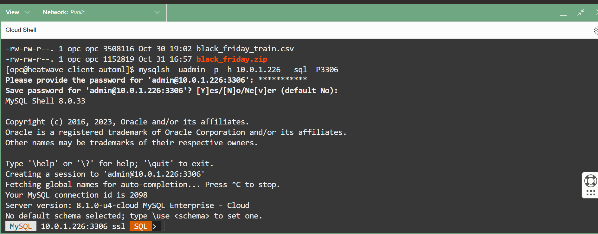
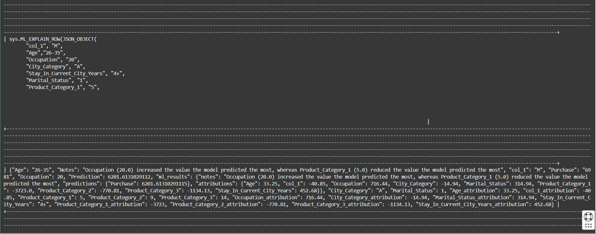

# Create and Use HeatWave AutoML Model - black_friday


## Introduction

HeatWave ML makes it easy to use machine learning, whether you are a novice user or an experienced ML practitioner. You provide the data, and HeatWave AutoML analyzes the characteristics of the data and creates an optimized machine learning model that you can use to generate predictions and explanations. An ML model makes predictions by identifying patterns in your data and applying those patterns to unseen data. HeatWave ML explanations help you understand how predictions are made, such as which features of a dataset contribute most to a prediction.

To load the black_friday data components, perform the following steps to create and load the required schema and tables. The requirements for Python 3 are already loaded in the compute instance and you have already installed MySQL Shell in the previous Lab.

After this step the data is stored in the MySQL HeatWave database in the following schema and tables:

**heatwaveml\_bench schema:** The schema containing training and test dataset tables.

**black\_friday\_train table:** The training dataset. Includes feature columns (Gender,Age,Occupation,City\_Category,Stay\_In\_Current\_City\_Years,Marital\_Status,Product\_Category\_1,Product\_Category\_2,Product\_Category\_3,Purchase).

**black\_friday\_test table:** The test dataset (unlabeled). Includes feature columns (Gender,Age,Occupation,City\_Category,Stay\_In\_Current\_City\_Years,Marital\_Status,Product\_Category\_1,Product\_Category\_2,Product\_Category\_3,Purchase).

_Estimated Time:_ 10 minutes

### Objectives

In this lab, you will be guided through the following task:

- Train the machine learning model
- Predict and Explain using the test table
- Score your machine learning model to assess its reliability and unload the model

### Prerequisites

- An Oracle Trial or Paid Cloud Account
- Some Experience with MySQL Shell
- Complete the following labs
    - Upload Train and Test  data to Object Storage for HeatWave Lakehouse
    - Load CSV Train and Test from OCI Object Store

## Task 1: Train the machine learning model

1. If not already connected with SSH, on Command Line, connect to the Compute instance using SSH ... be sure replace the  "private key file"  and the "new compute instance ip"

     ```bash
    <copy>ssh -i private_key_file opc@new_compute_instance_ip</copy>
     ```

2. If not already connected to MySQL then connect to MySQL using the MySQL Shell client tool with the following command:

    ```bash
    <copy>mysqlsh -uadmin -p -h 10.0.1... --sql -P3306</copy>
    ```

    

3. Set default database

    ```bash
    <copy>USE heatwaveml_bench;</copy>
    ```

4. Make sure the train and test tables

    ```bash
    <copy>show tables;</copy>
    ```

    

5. Train the model using ML_TRAIN. Since this is a classification dataset, the classification task is specified to create a classification model:

    ```bash
    <copy>CALL sys.ML_TRAIN('heatwaveml_bench.black_friday_train', 'Purchase', JSON_OBJECT('task', 'regression'), @model_black_friday);</copy>
    ```

6. When the training operation finishes, the model handle is assigned to the @model\_black\_friday session variable, and the model is stored in your model catalog. You can view the entry in your model catalog using the following query, where user1 is your MySQL account name:

    ```bash
    <copy>SELECT model_id, model_handle, train_table_name FROM ML_SCHEMA_admin.MODEL_CATALOG;</copy>
    ```

## Task 2: Make  Predictions and Explain Predictions

1. Load the model into HeatWave ML using ML\_MODEL\_LOAD routine:

    a.  Reset model handle variable

    ```bash
    <copy>SET @model_black_friday = (SELECT model_handle FROM ML_SCHEMA_admin.MODEL_CATALOG   ORDER BY model_id DESC LIMIT 1); </copy>
    ```

    b. A model must be loaded before you can use it. The model remains loaded until you unload it or the HeatWave Cluster is restarted.

    ```bash
    <copy>CALL sys.ML_MODEL_LOAD(@model_black_friday, NULL);</copy>
    ```

2. Make a prediction for a single row of data using the ML\_PREDICT\_ROW routine.

    ```bash
    <copy>SELECT sys.ML_PREDICT_ROW(JSON_OBJECT(
        "Gender", "M", 
        "Age","26-35", 
        "Occupation", "20", 
        "City_Category", "A", 
        "Stay_In_Current_City_Years", "4+", 
        "Marital_Status", "1", 
        "Product_Category_1", "5", 
        "Product_Category_2", "9", 
        "Product_Category_3", "14", 
        "Purchase", "6981"), 
        @model_black_friday, NULL);</copy>
    ```

    Based on the feature inputs that were provided, the model predicts that purchase value will be lower this year. The feature values used to make the prediction are also shown.

    

3. Now, generate an explanation for the same row of data using the ML\_EXPLAIN\_ROW.

    ```bash
    <copy>SELECT sys.ML_EXPLAIN_ROW(JSON_OBJECT(
        "Gender", "M", 
        "Age","26-35", 
        "Occupation", "20", 
        "City_Category", "A", 
        "Stay_In_Current_City_Years", "4+", 
        "Marital_Status", "1", 
        "Product_Category_1", "5", 
        "Product_Category_2", "9", 
        "Product_Category_3", "14", 
        "Purchase", "6981"), 
        @model_black_friday, 
        JSON_OBJECT('prediction_explainer', 'permutation_importance'));</copy>
    ```

    The attribution values show which features contributed most to the prediction

    


4. Make a prediction for the test table  data using the ML\_PREDICT\_ROW routine. This table can be used to gather more decision making information using OAC.

    ```bash
    <copy>CALL sys.ML_PREDICT_TABLE('heatwaveml_bench.black_friday_test', @model_black_friday,'heatwaveml_bench.black_predictions',NULL);</copy>
    ```

5. Retrieve some of the predictions individually

    ```bash
    <copy>SELECT * FROM heatwaveml_bench.black_predictions limit 5\G</copy>
    ```

6. Retrieve some of the predictions in row display

    a. Use Javascript

    ```bash
    <copy>\js</copy>

    ```

    b. Set MySQL Shell configuration option resultFormat to table

    ```bash
    <copy>shell.options.set('resultFormat','tabbed')</copy>

    ```

    b. List 5 rows

    ```bash
    <copy>session.sql("SELECT * FROM heatwaveml_bench.black_predictions limit 5")</copy>

    ```

7. Unload the model using ML\_MODEL\_UNLOAD:

    ```bash
    <copy>\sql</copy>

    ```

    ```bash
    <copy>CALL sys.ML_MODEL_UNLOAD(@model_black_friday);</copy>
    ```

    To avoid consuming too much space, it is good practice to unload a model when you are finished using it.

You may now **proceed to the next lab**

## Learn More

- [Oracle Cloud Infrastructure MySQL Database Service Documentation ](https://docs.cloud.oracle.com/en-us/iaas/MySQL-database)
- [MySQL HeatWave ML Documentation] (https://dev.mysql.com/doc/heatwave/en/heatwave-machine-learning.html)

## Acknowledgements

- **Author** - Perside Foster, MySQL Solution Engineering

- **Contributors** - Salil Pradhan, Principal Product Manager,
Nick Mader, MySQL Global Channel Enablement & Strategy Manager
- **Last Updated By/Date** - Perside Foster, MySQL Solution Engineering, October 2023
