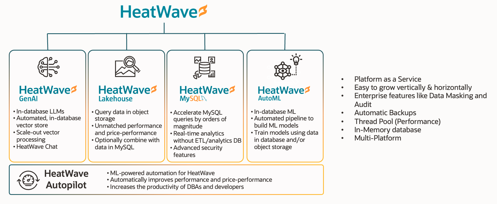
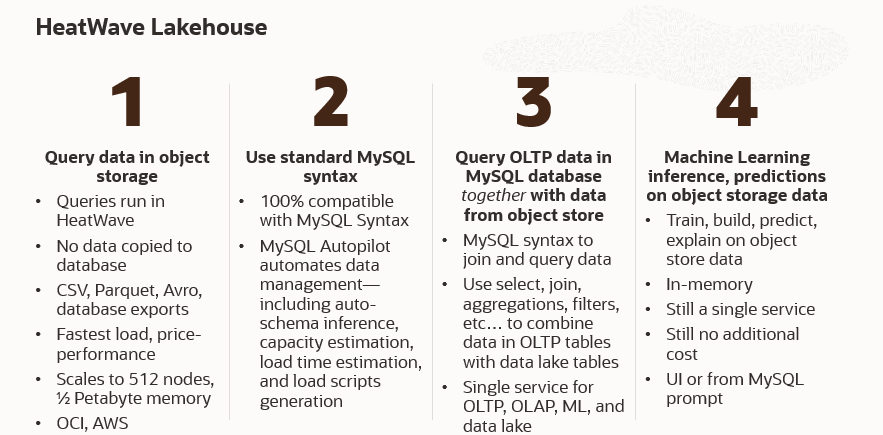
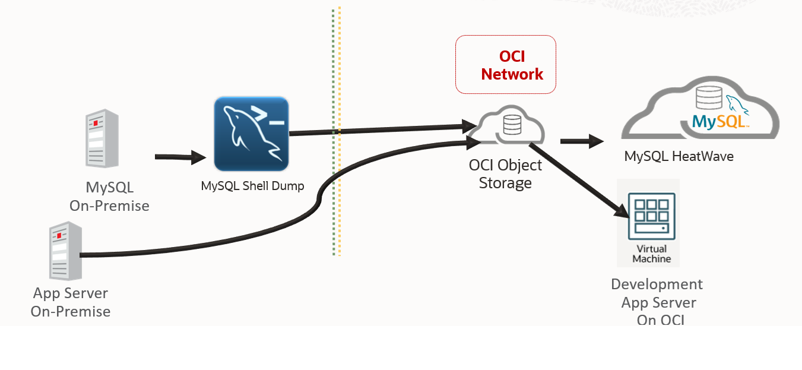

# Introduction

## About this Workshop

 HeatWave is a fully managed database service powered by the HeatWave in-memory query accelerator. It’s the only cloud service that combines transactions, real-time analytics across data warehouses and data lakes, machine learning, and lakehouse in one MySQL Database—without the complexity, latency, risks, and cost of ETL duplication. It’s available on OCI, AWS, and Azure.

In this workshop, you will learn how to create a HeatWave Cluster, connect to the cluster using MySQL Shell, run queries on HeatWave, create a machine learning model on lakehouse, create applications using the LAMP stack, as well as visualize data analytics through Oracle Analytics Cloud (OAC).

Overall this workshop will show you how easy it is to create and manage HeatWave and how HeatWave enables you to make informed business-critical decisions with real-time insights.

_Estimated Time:_ 
  
- Labs 1 through 5  : 1 hour
- Labs 1 through 18 : 4 hours

### About Product/Technology

 HeatWave is the only fully managed MySQL database service that seamlessly integrates transactions, analytics, machine learning, and Generative AI without the need for ETL duplication. As a massively parallel, high-performance, in-memory query accelerator, HeatWave significantly enhances MySQL performance for analytics and mixed workloads, enabling customers to run both OLTP and OLAP workloads directly within their MySQL database. It also includes HeatWave Lakehouse, allowing users to query data stored in object storage across various file formats. MySQL Autopilot further optimizes the database lifecycle by leveraging advanced machine learning to automate provisioning, data loading, query processing, and error handling—reducing administrative effort while enhancing performance and scalability. Additionally, HeatWave integrates with Oracle Cloud services such as Data Integration Service and Oracle Analytics Cloud, providing a seamless end-to-end data management and analytics experience.

#### HeatWave One Database for OLTP, OLAP, AutoML, Lakehouse & Generative AI

  

#### HeatWave Lakehouse in a Nutshell

  

### Objectives

#### Migrating from Eureka On-Premise to OCI / HeatWave Build Black-Friday ML process

1. Build and Load Heatwave and Add Cluster
2. Build Bastion App Server and compare OLTP and OLAP query executions
3. Add Black Friday data for AUTOML creation into Objecto Storage Bucket
4. Load Lakehouse with Object Sotrage Data and Create AUTOML Machine Learning Model
5. Make Black Friday Predictions and use OAC and APEX for more insight
6. Review ecommerce application and discuss improvement from Black-Friday ML Insight.

In this lab, you will be guided through the following steps:

- Create MySQL Database for HeatWave (DB System) instance
- Create SSH Key on Oracle Cloud Infrastructure Cloud Shell
- Setup Compute instance
- Connect to DB System using MySQL Shell through Compute Instance and Cloud Shell
- Create and Load sample database in MySQL Database
- Add HeatWave cluster to DB System
- Load sample data to HeatWave Cluster
- Run queries in HeatWave and MySQL and see the performance improvement in HeatWave!
- Create LAMP test application
- Stop OCI services
- **Bonus** Lakehouse, AutoML, and OAC Labs

### Prerequisites

- An Oracle Free Tier, Paid or LiveLabs Cloud Account
- Some Experience with MySQL Shell - [MySQL Site](https://dev.MySQL.com/doc/MySQL-shell/8.0/en/).

You may now **proceed to the next lab**

## Acknowledgements

- **Author** - Perside Foster, MySQL Solution Engineering

- **Contributors** - Abhinav Agarwal, Senior Principal Product Manager, Nick Mader, MySQL Global Channel Enablement & Strategy Manager, Oscar Cárdenas, MySQL Solution Engineering
- **Last Updated By/Date** - Oscar Cárdenas, MySQL Solution Engineering, March 2025

[def]: videohub:VideoID