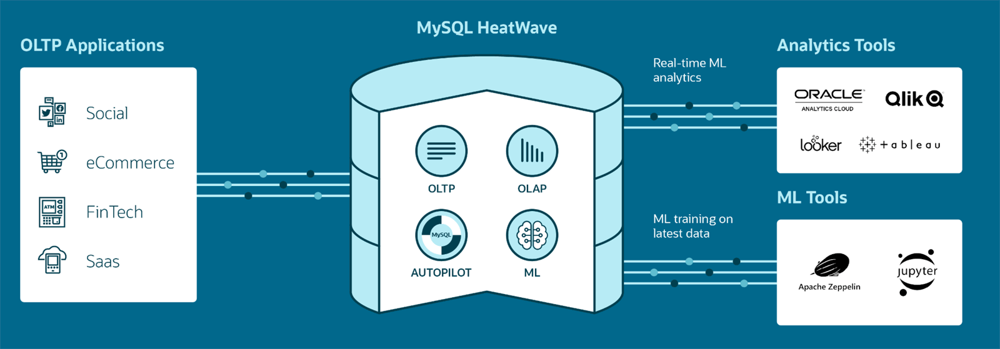

# Introduction

## About this Workshop

MySQL HeatWave is a fully managed database service powered by the HeatWave in-memory query accelerator. It’s the only cloud service that combines transactions, real-time analytics across data warehouses and data lakes, machine learning, and lakehouse in one MySQL Database—without the complexity, latency, risks, and cost of ETL duplication. It’s available on OCI, AWS, and Azure.

In this workshop, you will learn how to create a MySQL HeatWave Cluster, connect to the cluster using MySQL Shell, run queries on HeatWave, and create LAMP applications.

Overall this workshop will show you how easy it is to create and manage MySQL HeatWave and how MySQL HeatWave enables you to make informed business-critical decisions with real-time insights.

_Estimated Time:_ 
  
- Labs 1 through 5  : 1 hour
- Labs 1 through 10 : 2.5 hours

### About Product/Technology

MySQL HeatWave is a massively parallel, high performance, in-memory query accelerator for Oracle MySQL Database Service that accelerates MySQL performance by orders of magnitude for analytics and mixed workloads. It is the only service that enables customers to run OLTP and OLAP workloads directly from their MySQL database without the need of ETL process. MySQL Autopilot uses advanced machine-learning techniques to automates the database lifecycle operations including provisioning, data loading, query processing, and error handling. This minimizes manual administrative work and further improves HeatWave’s usability, performance, and scalability. MySQL HeatWave is also integrated with other Oracle Cloud services such as Data Integration Service and Oracle Analytics Cloud to provide a seamless end-to-end integration.

#### MySQL HeatWave One Database for OLTP, OLAP, ML & Lakehouse 

  

### Objectives

In this lab, you will be guided through the following steps:

- Create MySQL Database for HeatWave (DB System) instance
- Create SSH Key on Oracle Cloud Infrastructure Cloud Shell
- Setup Compute instance
- Connect to DB System using MySQL Shell through Compute Instance and Cloud Shell
- Create and Load sample database in MySQL Database
- Add HeatWave cluster to DB System
- Load sample data to HeatWave Cluster
- Run queries in HeatWave and MySQL and see the performance improvement in HeatWave!
- Create LAMP test application
- Stop OCI services
- **Bonus** Lakehouse, AutoML, and OAC Labs

### Prerequisites

- An Oracle Free Tier, Paid or LiveLabs Cloud Account
- Some Experience with MySQL Shell - [MySQL Site](https://dev.MySQL.com/doc/MySQL-shell/8.0/en/).

You may now **proceed to the next lab**

## Acknowledgements

- **Author** - Perside Foster, MySQL Solution Engineering

- **Contributors** - Abhinav Agarwal, Senior Principal Product Manager, Nick Mader, MySQL Global Channel Enablement & Strategy Manager
- **Last Updated By/Date** - Perside Foster, MySQL Solution Engineering, September 2023

[def]: videohub:VideoID